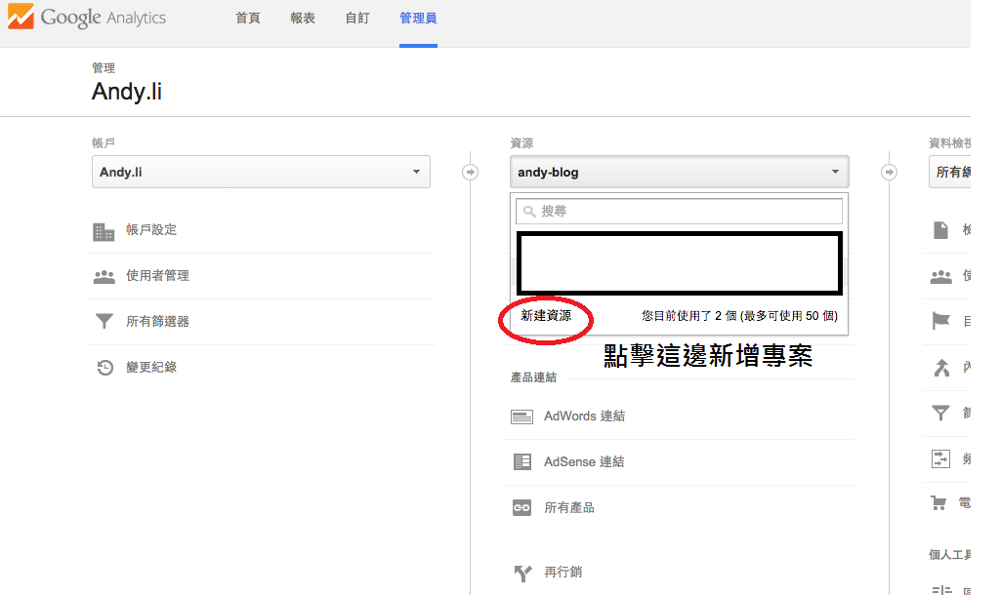
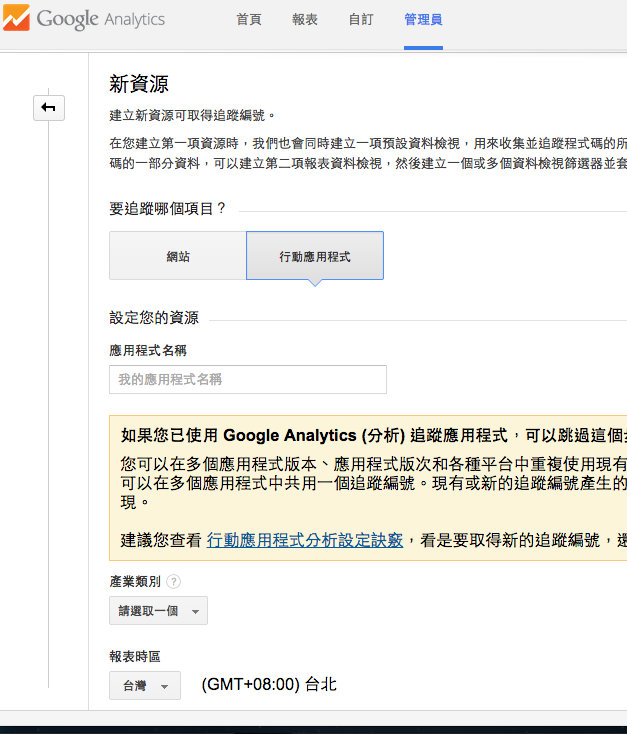
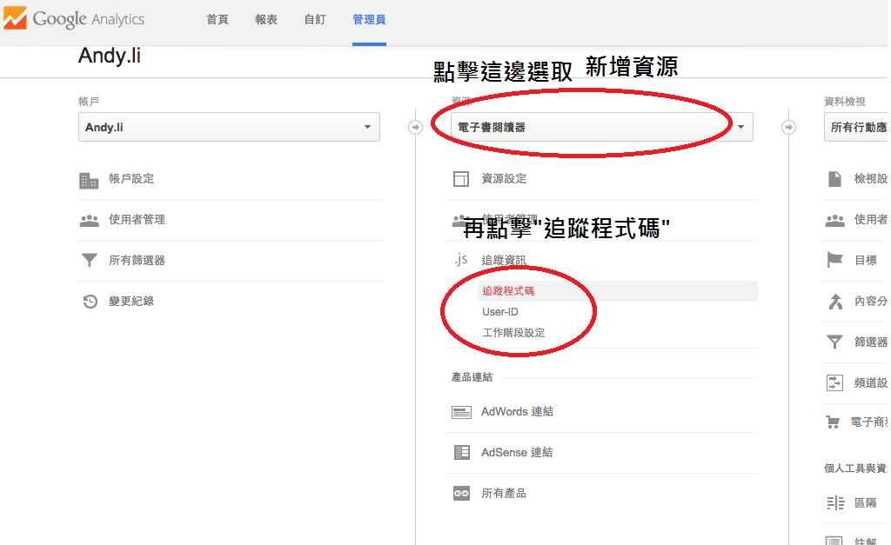
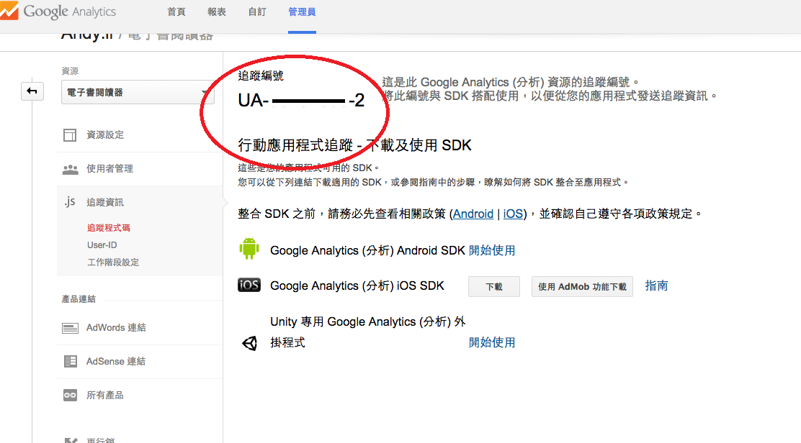

##Google analytics 教學 For Android APP

 [Google Analytics](http://www.google.com/intl/zh-TW/analytics/)由Ｇoogle提供訪客瀏覽人次、網頁瀏覽人次、用戶的瀏覽器、作業系統、螢幕解析度、網站熱門文章、熱門關鍵字、訪客來自於何處等等資料，可以統計和分析使用者.
 
  不僅僅可以網頁,也可以用在手機APP.
  
首先.先到Google Analytics[Google Analytics 網站](http://www.google.com/intl/zh-TW/analytics/)註冊索要追蹤的APP.

###先到以下畫面



###會到新增畫面,選擇行動應用程式,並根據項目填入資料並切新增.



###新增資後返回剛才畫面,



###進入程式碼追蹤,並取得追蹤編號.



###接下來就是到Android加入追蹤程式碼就可以看到結果.

###先將Project加入Ｇoogle Service Lib

###到AndroidManifest.xml中
###在Applcation內加入
```
<meta-data android:name="com.google.android.gms.version"
            android:value="@integer/google_play_services_version" />
```

###先到res,新增xml的資料夾

```
<?xml version="1.0" encoding="utf-8" ?>
<resources>
  <string name="ga_trackingId">我的追蹤編號</string>
  <!-- 可以在debug模式下追蹤-->
  <bool name="ga_debug">true</bool>
  <!--Enable Activity tracking-->
  <bool name="ga_autoActivityTracking">false</bool>
  <!--Enable automatic exception tracking-->
  <bool name="ga_reportUncaughtExceptions">true</bool> 
  
</resources>
```
###再到要追蹤的Ａctivity中

```
		//新增GoogleAnalytics物件
		GoogleAnalytics analytics = GoogleAnalytics.getInstance(this);
		analytics.getLogger().setLogLevel(Logger.LogLevel.VERBOSE);
		//取得追蹤物件新增xml設定檔
		Tracker mTracker = analytics.newTracker(R.xml.ga);
		//設定當前畫面名稱
		mTracker.setScreenNascreenName("畫面名稱");
	    //送出訊息
		mTracker.send(new HitBuilders.AppViewBuilder().build());
```
###再執行Ｐroject.就可以到[Google Analytics](http://www.google.com/intl/zh-TW/analytics/)看到結果.

###詳細設定可以查看[官方資訊](https://developers.google.com/analytics/devguides/collection/android/v4/)


